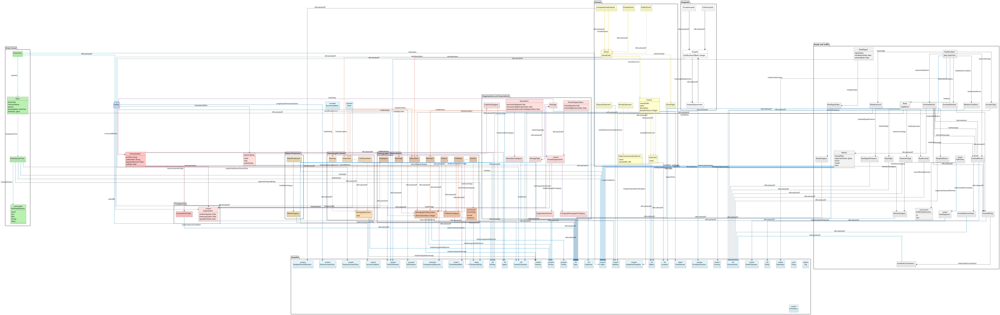

# OntoIM
The Ontology for Italian Municipalities.

[https://w3id.org/ontoim](https://w3id.org/ontoim)

## Description
This is an ontology to model an Italian Municipality, based on the [OntoPiA](https://github.com/italia/daf-ontologie-vocabolari-controllati) project.

It can describes:

- green areas and plant census
- schools, universities and courses (e.g. popular universities, music schools, sports courses offered by associations, etc...)
- hospitals
- road accidents, road signals, traffic flow
- demographic events and demographic observations (e.g. civil status, populations over the years, members of associations, etc...)
- waste production
- heritage

## Graphical Representation
